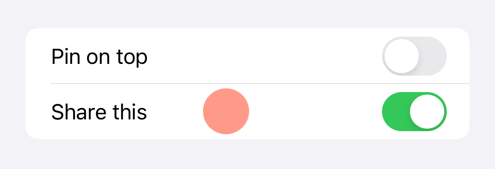
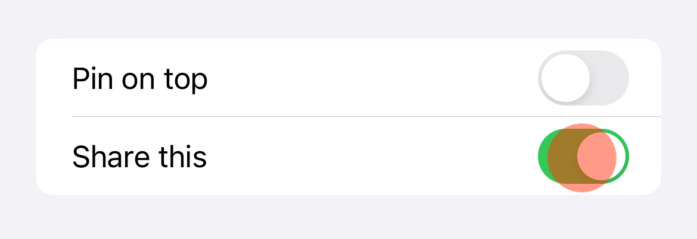

#  UI Tests for Toggle on iOS/iPadOS

This project shows how to implement UI tests that will interact with toggle components on iOS and iPadOS.

Indeed, simply using `tap()` on a switch or toggle `XCUIElement` will not do a lot.

This is because the tap point will interact with the center of the view, which is most of the time empty or the textual label.

To make thing work I implemented functions as `XCTestCase` extensions to be able to find the proper tapping point at switch center, _interact_ with it, and check the toggle state.

## Extension of `XCTestCase`

The extension is defined in the file [XCTestCase+toggle.swift](suiToggleUITests/xctest/XCTestCase+toggle.swift).

### Checking the State of a Toggle

You check the state of a toggle in two different ways:
1. _synchronously_ when you expect the state to be already defined.
2. by using an _expectation_ in an asynchronous query.

You have two function to check current state of the toggle:

- `checkToggleIsOn(_ toggle: XCUIElement)`
- `checkToggleIsOff(_ toggle: XCUIElement)`

Both will make the test fail if the state do not match.

If you need to rely on expectation, for example after an action that should update it, then you can use either of the following:

- `waitForSwitchToBeOn(_ element: XCUIElement, timeOut: TimeInterval)`
- `waitForSwitchToBeOff(_ element: XCUIElement, timeOut: TimeInterval)`

Both are building a query based on a predicate and wait for the expectation to be fulfilled in the given time interval.

### Interact With a Toggle

To change the state of a toggle there's two functions, one per state to follow the same pattern:

- `turnSwitchOn(_ toggle: XCUIElement)`
- ` turnSwitchOff(_ toggle: XCUIElement)`

Each function will proceed as follow:

1. the tap coordinate is computed based on inner _switch_ element inside the toggle.
2. first, the toggle is tapped. I must admit I have no idea why this is needed, but without this intermediate tap, the next one will have no effet.
3. tap on computed coordinate, the center of the switch.
4. Then function corresponding `waitForSwitchTobeXxx()`

> If anyone can explain me why the first tap is required I will be more than happy to understand!

## Project Content

- Code for the extension is in the UI target of the project.
- Project is a sample application
- Check the included UI tests of this app, especially [accessibility identifiers](doc/a11-identifiers.html)

## What's Next

Extension should be part of a simple framework to be imported for UI tests.
I'm working on it, but it's not ready yet.

All feedback is welcome.

